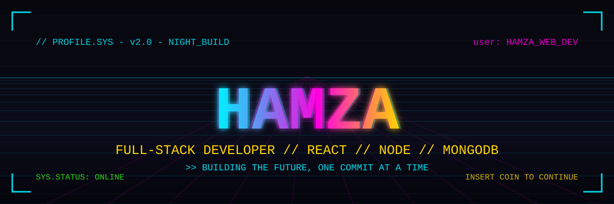

<p align="center">
  
</p>

<br>

```
====================================================================
  ███  H A M Z A   W E B   D E V  ███
  FULL-STACK MERN DEVELOPER - NIGHT CITY CODER
====================================================================
```

<p align="center">
  <a href="https://hamza-web-dev.github.io/portfolio/">
    
  </a>
  <a href="https://github.com/Hamza-Web-Dev">
    
  </a>
  <a href="mailto:hamzasif@gmail.com">
    
  </a>
  
</p>

> Jacked into the mainframe. Building modern, scalable, and user-focused web applications in the neon glow of the night city. Transforming ideas and designs into clean, responsive, and functional digital experiences — across frontend, backend, databases, and modern development tools.

---

## ▚ ABOUT.ME

```
$ whoami
> Full Stack MERN Developer
```

- 💻 Building full-stack applications with the **MERN stack** (React, Node.js, Express.js, MongoDB)
- ⚛️ Strong focus on **React.js** and modern frontend development
- 📘 Working with **JavaScript** and **TypeScript**
- 🎨 Creating responsive interfaces with **Tailwind CSS**
- 🔗 Building and consuming **REST APIs**
- 🧩 Obsessed with clean architecture, reusable components, and maintainable code
- 🐳 Familiar with Docker-based development environments
- 🔧 Using Git and GitHub for version control and collaboration
- 🧪 Interested in testing and improving application reliability
- 🚀 Working toward becoming a highly skilled full-stack engineer

---

## ▚ TECH.STACK

```
$ ls ./stack
```

<p align="center">
  <a href="https://github.com/Hamza-Web-Dev">
    
  </a>
</p>

---

## ▚ EXPERIENCE.LOG

### Frontend Development

- Developing modern interfaces using React.js
- Building responsive layouts with Tailwind CSS
- Creating reusable React components
- Integrating frontend applications with APIs
- Developing responsive experiences across different screen sizes
- Improving frontend performance and usability

### Backend Development

- Building RESTful APIs using Node.js and Express.js
- Working with authentication and authorization
- Connecting frontend applications with backend services
- Working with databases and CRUD operations
- Structuring backend applications for maintainability

### Testing & Quality

- Experience with automated testing workflows
- Writing and executing test cases
- Identifying and troubleshooting application issues
- Focused on reliable and maintainable applications

---

## ▚ MISSIONS.ACTIVE

### SHEZREEN - Luxury Fashion E-Commerce

A luxury fashion storefront — product catalog served by a MongoDB-backed Express API, with graceful offline fallback and responsive product browsing.

**LOADED MODULES:** `React.js` · `Node.js` · `Express.js` · `MongoDB`

**[View Mission](https://github.com/Hamza-Web-Dev/Shezreen-Web)**

### MERN Portfolio Website

A full-stack portfolio website built with the MERN stack — projects loaded from MongoDB and a working contact form.

**LOADED MODULES:** `React.js` · `Node.js` · `Express.js` · `MongoDB`

**[View Mission](https://github.com/Hamza-Web-Dev/portfolio)** · **[Live Demo](https://hamza-web-dev.github.io/portfolio/)**

### Full-Stack Web Applications

Building full-stack applications that combine modern frontend interfaces with backend APIs and database systems.

**LOADED MODULES:** `React.js` · `JavaScript` · `TypeScript` · `Node.js` · `Express.js` · `MongoDB`

### E-Commerce & Task Management

Developing e-commerce functionality and productivity-focused applications — CRUD operations, API integration, authentication, and responsive interfaces.

**LOADED MODULES:** `React.js` · `Node.js` · `Express.js` · `MongoDB`

> More missions are being compiled and will be deployed here as the portfolio grows.

---

## ▚ UPLINK.STATS

<p align="center">
  
  
</p>

<p align="center">
  
</p>

---

## ▚ UPGRADE.PATH

```
$ ./current_objectives
```

- Building full-stack applications with the MERN stack
- Improving advanced React.js development
- Strengthening TypeScript skills
- Improving Node.js and Express.js development
- Deepening knowledge of MongoDB and database design
- Building better REST APIs
- Learning scalable application architecture
- Improving Docker and development environment skills
- Learning better testing practices
- Expanding knowledge of cloud technologies
- Contributing to open-source projects

---

## ▚ CONNECT

<p align="center">
  <a href="https://github.com/Hamza-Web-Dev">
    
  </a>
  <a href="https://hamza-web-dev.github.io/portfolio/">
    
  </a>
  <a href="mailto:hamzasif@gmail.com">
    
  </a>
</p>

---

## ▚ PHILOSOPHY

> **BUILD. LEARN. IMPROVE. REPEAT.**

The best way to become a better developer is to keep building, keep learning, and keep improving.

---

```
====================================================================
  SYS.DISCONNECT
  THANKS FOR VISITING MY PROFILE
====================================================================
```
